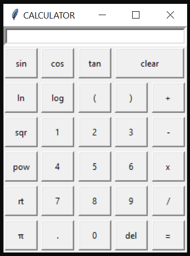

# Simple-python-calculator  
A simple calculator using python and python's tkinter module for GUI  
  
In order to perform tan, sin, cos operation on a number, the number should be inputted first and then these buttons must be clicked.  
All the inputs must be given from the GUI.  
